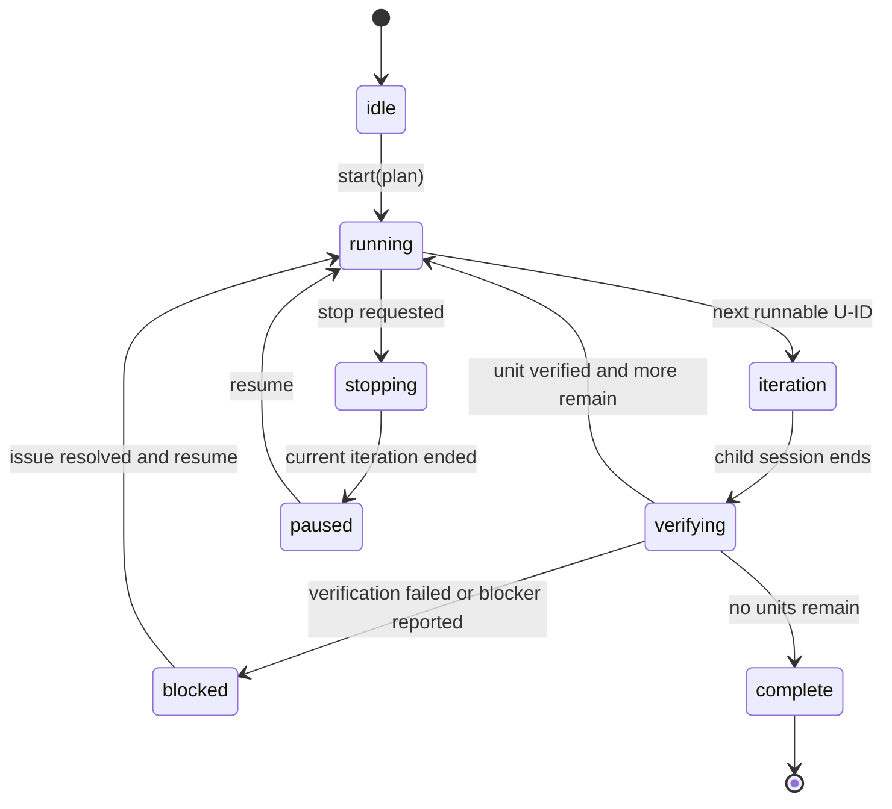

# feat: Add native SE work loop

## Summary

Add a native Software Engineering loop controller that runs SE plan implementation units in fresh child sessions, persists progress on disk, and gates advancement on unit verification. The loop should extend the existing `se-plan`/`se-work` model rather than depending on or exposing an external Ralph-style package vocabulary.

---

## Problem Frame

The package already owns structured planning, execution, subagent personas, and verification discipline, but it lacks a durable autonomous controller for long-running plan execution. Depending on an external loop package would add overlapping concepts such as PRDs, hats, scratchpads, and completion promises that compete with SE plans and U-IDs.

---

## Assumptions

*This plan was authored from the prior design discussion without a separate synchronous confirmation checkpoint. The items below are agent inferences that should be reviewed before implementation proceeds.*

- The loop should be implemented natively inside `pi-software-engineering`, not as a dependency on `@lnilluv/pi-ralph-loop`, `pi-until-done`, or another Ralph package.
- The first version should prioritize the core loop primitive over a rich TUI overlay: start, status, stop, resume, fresh-session iteration, and durable state.
- The loop should execute existing SE plan units rather than introduce a second planning artifact such as `.ralphi/prd.json` or `RALPH.md` as the canonical source of truth.
- Cross-model judge gating is valuable but should be deferred until the native loop and verification-command path are stable.

---

## Requirements

- R1. Provide a native `/se-work-loop` entry point for executing a saved SE plan across repeated fresh-context iterations.
- R2. Preserve SE plan semantics: Implementation Units with U-IDs remain the canonical unit of work, and plan files are not mutated for per-unit progress.
- R3. Keep main-chat context small by running each implementation iteration in a child session and persisting loop state on disk.
- R4. Persist enough state to stop, resume, inspect, and recover a loop after session restart or compaction.
- R5. Gate unit advancement on observable verification evidence, including unit Verification outcomes and optional command-based checks.
- R6. Integrate naturally with existing `se-work`, `se-worktree`, subagent, and reviewer workflows instead of replacing them.
- R7. Avoid new external runtime dependencies unless implementation proves Pi APIs cannot support the loop directly.
- R8. Define a stable MVP command contract, including start, status, stop, resume, and verification-command discovery behavior.

---

## Scope Boundaries

- Do not vendor an entire external Ralph implementation wholesale.
- Do not add a competing PRD, hat, or workflow vocabulary that duplicates `se-plan`, `se-work`, `se-debug`, or `se-code-review`.
- Do not modify plan bodies to track loop progress; progress lives in loop state and git history.
- Do not implement a full TUI loop browser in the first version.
- Do not require the standalone `ralph` CLI.
- Do not make cross-model judging mandatory in the first version.

### Deferred to Follow-Up Work

- Optional cross-model judge gate: add after command-based verification and state persistence are proven.
- Rich TUI overlay for loop history/diff browsing: defer until command/status behavior is stable.
- Worktree-isolated child execution: integrate after baseline child-session looping works in the current working tree.
- Package-level docs site or screenshots: defer until the user-facing command shape is validated.

---

## Context & Research

### Relevant Code and Patterns

- `extensions/software-engineering.ts` currently owns SE package startup behavior and symlinks packaged `se-*` agents into `~/.pi/agent/agents`.
- `package.json` declares Pi extension and skill resources; adding a loop extension requires updating `pi.extensions` and keeping package `files` coverage.
- `skills/se-work/SKILL.md` already defines SE task execution from plan Implementation Units, including U-ID preservation, verification as done signal, subagent dispatch, and worktree-aware execution constraints.
- `skills/se-optimize/SKILL.md` establishes a strong disk-persistence precedent: state must live on disk, writes are verified, and the conversation is not durable storage.
- `node_modules/pi-subagents/src/slash/slash-commands.ts` shows bundled extension command registration patterns in this package’s dependency tree.

### Institutional Learnings

- No `docs/solutions/` directory was present in the target repo during planning, so there were no local institutional learnings to carry forward.

### External References

- `rahulmutt/pi-ralph` demonstrates the clean Pi pattern of branching every iteration from the original parent session with `ctx.newSession({ parentSession, withSession })` so previous iterations do not pollute later context.
- `lnilluv/pi-ralph-loop` demonstrates useful completion-gate concepts: required outputs, acceptance command reruns, open-question readiness, and stop/cancel semantics.
- `samfoy/pi-ralph` demonstrates disk handoff between fresh sessions via a scratchpad file, but its hat model overlaps with SE personas and should not be copied directly.
- `manojlds/ralphi` demonstrates persistent story state and fresh child sessions, but its PRD JSON source-of-truth overlaps with SE plans and should not be adopted.
- `srinitude/pi-until-done` demonstrates a strong judge-gate pattern that can inform a future optional SE verification judge.

---

## Key Technical Decisions

- Implement the loop as an SE-native Pi extension: this gives the controller access to `ctx.newSession`, UI status, command registration, and session events without forcing users to install another package.
- Keep `se-work` as the executor: the loop controller should create bounded prompts that invoke or instruct `se-work` on one current U-ID, not reimplement execution policy.
- Store loop state under `.context/software-engineering/se-work-loop/`: this matches the package’s existing local scratch-state convention from `se-optimize` and avoids committing volatile loop state.
- Use U-IDs as loop cursors: the plan’s stable U-ID rule provides durable references across plan edits without adding checkboxes or progress markers to the plan body.
- Start with command-based verification and file existence checks: these are deterministic and easier to debug than an LLM judge.
- Define one explicit MVP command surface up front: `/se-work-loop <plan-path> [--verify-command "..."]`, `/se-work-loop-status [id]`, `/se-work-loop-stop <id>`, and `/se-work-loop-resume <id>`. Prefer separate discoverable slash commands over opaque subcommands hidden behind `/se-work-loop ...`.
- Discover target-project verification before durable loop creation when the user does not provide `--verify-command`: inspect obvious project conventions such as package scripts, known test commands, repo guidance, and plan Verification text. If discovery cannot identify a credible command, ask the user or leave the loop uncreated rather than writing an under-specified state file.
- Keep the extension modular: add a focused loop extension entry rather than expanding `extensions/software-engineering.ts` into a large controller file.

---

## Open Questions

### Resolved During Planning

- Should this depend on an external Ralph package? Resolved as no; the SE package already owns the planning/execution semantics, and only the loop primitive should be folded in.
- Should role hats be adopted? Resolved as no; SE reviewer/research agents and skills already provide role specialization.
- Should the plan file track progress? Resolved as no; this would violate current `se-work` guidance that progress is derived from git and execution state, not plan-body mutation.
- What should the MVP command surface be? Resolved as separate explicit slash commands for each action: `/se-work-loop`, `/se-work-loop-status`, `/se-work-loop-stop`, and `/se-work-loop-resume`.

### Deferred to Implementation

- Exact test harness for TypeScript extension code: the package currently has no test script or TypeScript test runner, so implementation should choose a minimal runner only after confirming local runtime constraints.
- Whether loop state should include compacted assistant summaries from child sessions: decide after seeing what events and transcript APIs are available in the current Pi version.

---

## High-Level Technical Design

> *This illustrates the intended approach and is directional guidance for review, not implementation specification. The implementing agent should treat it as context, not code to reproduce.*

```mermaid
sequenceDiagram
    participant User
    participant Loop as se-loop extension
    participant State as .context/software-engineering/se-work-loop
    participant Child as fresh child session
    participant Work as se-work executor

    User->>Loop: /se-work-loop docs/plans/example-plan.md
    Loop->>Loop: discover or confirm verify command
    Loop->>State: create or load loop state from plan U-IDs
    Loop->>Child: create child session from controller parent
    Child->>Work: execute bounded prompt for current U-ID
    Work->>Child: implement, test, summarize evidence
    Child->>Loop: iteration finished
    Loop->>State: record summary, files, verification result
    Loop->>Loop: advance, stop, or block
    Loop->>User: compact status only
```

The parent chat should receive status updates and compact summaries only. Detailed implementation context remains in child sessions and on disk.

---

## Output Structure

    extensions/
      se-loop/
        index.ts
        runtime-probe.ts
        plan-parser.ts
        state-store.ts
        controller.ts
        verification.ts
        verify-command-discovery.ts
    skills/
      se-work-loop/
        SKILL.md
    tests/
      se-loop-plan-parser.test.mjs
      se-loop-state-store.test.mjs

---

## Implementation Units

### U1. Add loop package surface

**Goal:** Expose a native SE loop extension and skill through the package manifest without disrupting existing agent symlink behavior.

**Requirements:** R1, R6, R7

**Dependencies:** None

**Files:**
- Modify: `package.json`
- Modify: `README.md`
- Create: `extensions/se-loop/index.ts`
- Create: `skills/se-work-loop/SKILL.md`

**Approach:**
- Add `./extensions/se-loop/index.ts` to `pi.extensions` while leaving `extensions/software-engineering.ts` responsible for startup symlink behavior.
- Register the MVP command surface as separate discoverable slash commands: `/se-work-loop <plan-path> [--verify-command "..."]`, `/se-work-loop-status [id]`, `/se-work-loop-stop <id>`, and `/se-work-loop-resume <id>`.
- Add a `se-work-loop` skill that explains when to use the loop, how it relates to `se-work`, and what state files it creates.
- Document the capability as folded-in SE automation, not as bundled Ralph.

**Execution note:** Start by adding the smallest no-op extension command and skill registration path, then verify Pi can load both before building controller behavior.

**Patterns to follow:**
- `extensions/software-engineering.ts`
- `package.json`
- `skills/se-work/SKILL.md`
- `README.md`

**Test scenarios:**
- Happy path: package manifest includes the new extension and existing software-engineering extension remains present.
- Happy path: package manifest includes `./skills`, so the new `skills/se-work-loop/SKILL.md` is discoverable without a separate manifest entry.
- Happy path: command help/status text lists the four explicit commands and does not require users to remember hidden subcommands.
- Error path: loading the package with only the new placeholder command does not interfere with agent symlink notifications.

**Verification:**
- Pi package metadata references the loop extension.
- Existing SE extension entry remains unchanged.
- README explains native loop positioning and avoids instructing users to install an external loop package.

---

### U8. Validate Pi child-session runtime

**Goal:** Prove the installed Pi runtime can create fresh child sessions, deliver a bounded prompt, observe completion, and return control to the loop controller before building durable parser/controller layers on top of that assumption.

**Requirements:** R1, R3, R4, R6, R8

**Dependencies:** U1

**Files:**
- Create: `extensions/se-loop/runtime-probe.ts`
- Modify: `extensions/se-loop/index.ts`
- Modify: `skills/se-work-loop/SKILL.md`

**Approach:**
- Add a minimal development-only or hidden smoke command that exercises `ctx.newSession` from a controller session, sends a small bounded prompt, and records whether the child session completes.
- Verify whether child sessions can branch from a captured parent session file and whether completion can be observed through available Pi events or command-context APIs.
- Capture the safest prompt shape for later controller work: direct skill invocation if supported, otherwise a plain-language bounded prompt that tells the child to load `se-work` semantics for one U-ID.
- Do not create persistent loop state until this runtime probe passes in the installed Pi version.

**Patterns to follow:**
- Fresh-session patterns observed in `rahulmutt/pi-ralph` and `manojlds/ralphi`
- `extensions/software-engineering.ts`

**Test scenarios:**
- Happy path: runtime probe creates a child session from the controller session and receives a completion signal.
- Happy path: runtime probe can send a bounded prompt to the child without appending the child transcript to the parent chat.
- Error path: runtime probe failure reports a clear unsupported-runtime message and blocks loop start.
- Edge case: cancelled child-session creation leaves no durable loop state behind.

**Verification:**
- Manual Pi smoke test proves child-session creation, prompt delivery, and completion observation before U2/U3/U4 depend on those APIs.
- The implementation records the runtime assumptions in comments or README troubleshooting notes so future Pi API drift is diagnosable.

---

### U2. Parse SE plans into loop units

**Goal:** Extract stable U-ID implementation units, dependencies, files, test scenarios, and verification text from SE plan documents into a controller-friendly representation.

**Requirements:** R2, R5

**Dependencies:** U1, U8

**Files:**
- Create: `extensions/se-loop/plan-parser.ts`
- Create: `tests/se-loop-plan-parser.test.mjs`

**Approach:**
- Parse markdown headings matching `### U<N>. <name>` and capture the fields defined by `se-plan`: Goal, Requirements, Dependencies, Files, Approach, Execution note, Patterns to follow, Test scenarios, and Verification.
- Preserve unknown field text rather than failing hard, but block loop start when no U-IDs are found.
- Treat dependencies as U-ID references, not array indexes, so plan edits do not break saved state.
- Keep parsing intentionally conservative; the plan remains human-authored markdown, not a new machine-only schema.

**Patterns to follow:**
- `skills/se-plan/SKILL.md`
- `skills/se-work/SKILL.md`

**Test scenarios:**
- Happy path: a plan with U1 and U2 produces two units with names, dependencies, files, and verification text.
- Edge case: deleted or skipped U-ID gaps such as U1 and U3 are preserved without renumbering.
- Error path: a markdown file with no `### U<N>.` headings returns a clear parse error suitable for user display.
- Edge case: a unit with `Test expectation: none -- [reason]` is parsed as intentionally non-feature-bearing rather than missing tests.

**Verification:**
- Parser tests cover standard units, U-ID gaps, missing units, and no-test-expectation units.
- Parser output contains enough context to construct a bounded child-session prompt for a single unit.

---

### U3. Persist loop state on disk

**Goal:** Add crash-safe loop state storage that records plan path, unit statuses, iteration history, stop requests, and compact evidence without relying on conversation memory.

**Requirements:** R3, R4

**Dependencies:** U2, U8

**Files:**
- Create: `extensions/se-loop/state-store.ts`
- Create: `tests/se-loop-state-store.test.mjs`
- Modify: `.gitignore`

**Approach:**
- Store state under `.context/software-engineering/se-work-loop/<loop-id>/`.
- Use a JSON state file for controller state and append-only JSONL or markdown logs for iteration summaries.
- Follow `se-optimize` persistence discipline: write critical state immediately, read it back when possible, and treat disk as the source of truth at phase boundaries.
- Ensure `.context/` is ignored locally if it is not already ignored.

**Patterns to follow:**
- `skills/se-optimize/SKILL.md`
- `.gitignore`

**Test scenarios:**
- Happy path: creating a loop writes state to the expected `.context/software-engineering/se-work-loop/<loop-id>/state.json` location.
- Happy path: updating a unit status and reloading from disk returns the updated status.
- Edge case: resuming from a missing or malformed state file returns a clear recoverable error.
- Error path: a failed write does not report success without a read-back verification.

**Verification:**
- State store tests prove create, update, reload, and malformed-state behavior.
- Loop state files are ignored by git.
- State schema includes plan path, controller session file when available, current U-ID, per-unit status, stop flag, iteration count, and compact summaries.

---

### U4. Implement fresh-session loop controller

**Goal:** Run one bounded SE work iteration per child session, branch each iteration from the controller session, and keep detailed implementation context out of the parent chat.

**Requirements:** R1, R3, R4, R6

**Dependencies:** U2, U3, U8

**Files:**
- Create: `extensions/se-loop/controller.ts`
- Modify: `extensions/se-loop/index.ts`

**Approach:**
- Register separate slash commands for starting, stopping, resuming, and checking status using the explicit command contract from U1.
- Before creating durable loop state, require either an explicit `--verify-command` or a discovered target-project verification command; if discovery is inconclusive, ask the user rather than writing an under-specified loop file.
- Capture the controller session once when a loop starts and create fresh child sessions from that parent for each iteration.
- Send each child session a bounded prompt containing the plan path, current U-ID, relevant unit fields, state path, and instruction to use `se-work` semantics for that unit only.
- Record child completion summaries in disk state and display only compact progress in the parent UI.
- Respect graceful stop: finish the current iteration, then stop before starting the next unit.

**Technical design:**



**Patterns to follow:**
- `extensions/software-engineering.ts`
- Ralph-style fresh session patterns observed in `rahulmutt/pi-ralph` and `manojlds/ralphi`
- `skills/se-work/SKILL.md`

**Test scenarios:**
- Happy path: starting a loop creates state and schedules the first runnable U-ID.
- Happy path: after a child session completes, the controller records the summary and advances to the next dependency-ready U-ID.
- Edge case: a stop request during an active iteration pauses after the child session finishes.
- Error path: child session creation cancellation leaves the loop in a paused or recoverable state rather than losing state.
- Integration: parent chat receives compact status updates while child prompts carry the detailed unit context.

**Verification:**
- Manual Pi smoke test can start a loop from a sample plan, observe a child session, and show that the parent chat receives status rather than full implementation transcript.
- Stop and status commands operate on persisted state, not only in-memory variables.

---

### U5. Add verification gates

**Goal:** Block unit advancement until the unit has observable completion evidence, including optional command checks and required output files derived from the plan.

**Requirements:** R5, R6

**Dependencies:** U3, U4

**Files:**
- Create: `extensions/se-loop/verification.ts`
- Create: `extensions/se-loop/verify-command-discovery.ts`
- Modify: `extensions/se-loop/controller.ts`
- Modify: `skills/se-work-loop/SKILL.md`

**Approach:**
- Start with deterministic gates: required files from the unit Files field, child-reported test/verification evidence, and a loop-level verify command supplied by the user or discovered before loop creation.
- Do not require plans to contain shell command recipes; discover target-project verification from package scripts, common repo commands, AGENTS/README guidance, and plan Verification text when the user does not provide `--verify-command`.
- If verification discovery is unknown or ambiguous, ask the user for the command before creating the loop state file; do not create a durable loop whose final gate is undefined.
- Treat failed verification as a blocked or retryable state with the failure evidence written to disk.
- Leave cross-model judge integration as a future gate after deterministic verification proves useful.

**Patterns to follow:**
- `skills/se-work/SKILL.md` verification-as-done-signal language
- `skills/se-optimize/SKILL.md` hard gate and measurement-result persistence discipline
- Completion gate concepts from `lnilluv/pi-ralph-loop`

**Test scenarios:**
- Happy path: unit with required files present and successful child-reported verification advances.
- Happy path: explicit `--verify-command` success allows advancement.
- Happy path: discovered target-project verify command is saved into loop state before the first child session starts.
- Error path: unknown or ambiguous verify command blocks loop creation and asks the user for clarification.
- Error path: missing required output file blocks advancement and records the missing path.
- Error path: failing verify command blocks advancement and records command output.
- Edge case: a non-feature-bearing unit with `Test expectation: none -- [reason]` can complete without test evidence but still records the reason.

**Verification:**
- Verification code records pass/fail evidence in loop state.
- Failed gates are visible through `/se-work-loop-status` output.
- Controller never marks a unit complete solely because a child session said it was done when deterministic gates fail.

---

### U6. Add resume, status, and recovery UX

**Goal:** Make long-running loops operationally usable across restarts, compaction, and interrupted sessions.

**Requirements:** R3, R4, R6

**Dependencies:** U3, U4, U5

**Files:**
- Modify: `extensions/se-loop/index.ts`
- Modify: `extensions/se-loop/controller.ts`
- Modify: `extensions/se-loop/state-store.ts`
- Modify: `README.md`
- Modify: `skills/se-work-loop/SKILL.md`

**Approach:**
- Provide `/se-work-loop-status [id]`, `/se-work-loop-stop <id>`, `/se-work-loop-resume <id>`, and a recent-loop listing through the status command output.
- On session start, load known active loop state and show a concise UI notification or status item when active or paused loops exist.
- Resume from disk by re-parsing the plan, reconciling known U-IDs, and continuing from the first unverified dependency-ready unit.
- If the plan changed since loop creation, surface the mismatch and require explicit resume behavior rather than silently executing stale assumptions.

**Patterns to follow:**
- `extensions/software-engineering.ts` startup notification style
- `skills/se-optimize/SKILL.md` resume discipline
- `skills/se-work/SKILL.md` U-ID stability and plan-progress rules

**Test scenarios:**
- Happy path: status lists current loop ID, plan path, current U-ID, completed units, blocked units, and latest verification evidence.
- Happy path: resume reloads state from disk and continues the next eligible unit.
- Edge case: plan file missing on resume reports a clear blocked state.
- Edge case: plan U-ID removed or modified on resume reports a reconciliation warning.
- Error path: stop command on a non-running loop reports no active loop without corrupting state.

**Verification:**
- Manual smoke test demonstrates start, status, stop, resume, and completion using a small sample plan.
- Restarting Pi or opening a new session can discover paused/active loop state from disk.

---

### U7. Document and validate first-use workflow

**Goal:** Make the native loop understandable to users and safe for implementers to validate without external package knowledge.

**Requirements:** R1, R6, R7

**Dependencies:** U1, U4, U5, U6

**Files:**
- Modify: `README.md`
- Modify: `skills/se-work-loop/SKILL.md`
- Create: `docs/examples/se-work-loop-sample-plan.md`

**Approach:**
- Add a small sample plan with two U-IDs, one dependency, and simple verification text.
- Document recommended usage: plan with `se-plan`, execute with `se-work-loop` for long-running multi-unit work, use regular `se-work` for short work.
- Explain context behavior explicitly: parent chat stays compact, child sessions do the detailed work, disk state is the durable source.
- Include troubleshooting guidance for stale plans, missing state, blocked verification, and unavailable Pi session APIs.

**Patterns to follow:**
- `README.md`
- `skills/se-plan/SKILL.md`
- `skills/se-work/SKILL.md`
- `skills/se-optimize/SKILL.md`

**Test scenarios:**
- Happy path: following the README sample starts a loop and produces state under `.context/software-engineering/se-work-loop/`.
- Error path: sample troubleshooting covers missing plan, missing U-IDs, and failed verification.
- Integration: documentation clearly distinguishes `se-work-loop` from external Ralph packages and from `se-optimize`.

**Verification:**
- README and skill docs explain when to choose `se-work-loop` vs `se-work`.
- Sample plan exercises parser, controller, verification, and status commands in a manual smoke test.

---

## System-Wide Impact

- **Interaction graph:** New loop extension interacts with Pi command registration, session lifecycle, UI status/notifications, child sessions, and existing SE skills. It should not alter existing agent symlink behavior.
- **Error propagation:** Child-session failures, cancelled session creation, parser errors, and verification failures should transition the loop into blocked or paused states with disk evidence rather than throwing away progress.
- **State lifecycle risks:** Disk state can become stale if the plan changes, the branch changes, or files are moved. Resume must reconcile current plan U-IDs against saved state.
- **API surface parity:** README, slash commands, and skill docs should use the same command names and state terminology.
- **Integration coverage:** Unit tests can cover parser and state store behavior; controller behavior needs Pi smoke tests because it depends on runtime session APIs.
- **Unchanged invariants:** Existing `se-plan` and `se-work` remain valid standalone workflows. The loop is an optional long-running controller, not a replacement executor.

---

## Risks & Dependencies

| Risk | Mitigation |
|------|------------|
| Pi session APIs differ from observed external implementations | Start with a no-op command and a tiny child-session smoke test before building full controller behavior |
| Loop duplicates `se-work` instead of orchestrating it | Keep child prompts bounded to one U-ID and explicitly route execution posture through `se-work` semantics |
| State corruption during long runs | Follow `se-optimize` write/read-back persistence discipline and keep state transitions small |
| Verification becomes too subjective | Begin with deterministic gates; defer LLM judge until deterministic evidence is represented well |
| Plans edited during loop execution create stale state | Re-parse on resume and detect U-ID mismatch before continuing |
| No existing TypeScript test harness | Start with pure parser/state tests using the smallest viable Node test setup, then defer full Pi runtime tests to manual smoke testing |

---

## Alternative Approaches Considered

- Depend directly on `@lnilluv/pi-ralph-loop`: rejected because it introduces `RALPH.md` and completion-promise vocabulary that does not naturally preserve SE U-ID plan semantics.
- Adopt `samfoy/pi-ralph` hats: rejected because hats duplicate existing SE skills and reviewer personas.
- Adopt `manojlds/ralphi` PRD JSON: rejected because SE plans already provide the canonical plan artifact and stable implementation units.
- Require `pi-until-done`: deferred because its judge pattern is valuable, but the `mise` and judge requirements are too opinionated for the first native SE loop.
- Use only `se-work` subagents without a controller extension: rejected because subagents give fresh contexts but do not provide durable loop state, stop/resume, or long-running status.

---

## Phased Delivery

### Phase 1: Minimal native loop shell
- Add extension entry, skill docs, command contract, and runtime child-session probe.
- Verify package loading and Pi child-session assumptions before creating durable loop state.
- Add plan parser and disk state store after the runtime probe passes.

### Phase 2: Fresh-session execution
- Add child-session controller for one U-ID at a time.
- Add start, stop, status, and compact parent-chat status.

### Phase 3: Verification and resume
- Add deterministic verification gates.
- Add resume/reconciliation behavior and sample workflow docs.

### Phase 4: Advanced gates later
- Evaluate optional cross-model judge, worktree isolation, richer loop UI, and deeper integration with `se-code-review`.

---

## Documentation / Operational Notes

- Document that `.context/software-engineering/se-work-loop/` is local scratch state and should not be committed.
- Document that loop progress is operational state, while the plan remains a decision artifact.
- Document that stopped or blocked loops are resumable after fixing the underlying issue or updating the plan.
- Document manual smoke-test expectations because full Pi child-session behavior may not be covered by ordinary Node tests.

---

## Sources & References

- Related code: `extensions/software-engineering.ts`
- Related package metadata: `package.json`
- Related execution workflow: `skills/se-work/SKILL.md`
- Related persistence pattern: `skills/se-optimize/SKILL.md`
- Related planning structure: `skills/se-plan/SKILL.md`
- Reference implementation: `rahulmutt/pi-ralph`
- Reference implementation: `lnilluv/pi-ralph-loop`
- Reference implementation: `samfoy/pi-ralph`
- Reference implementation: `manojlds/ralphi`
- Reference implementation: `srinitude/pi-until-done`
